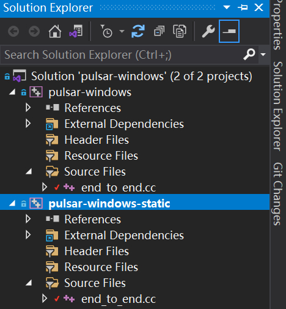
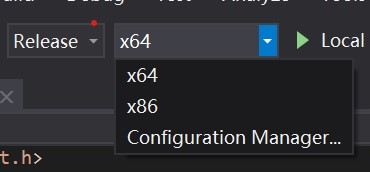
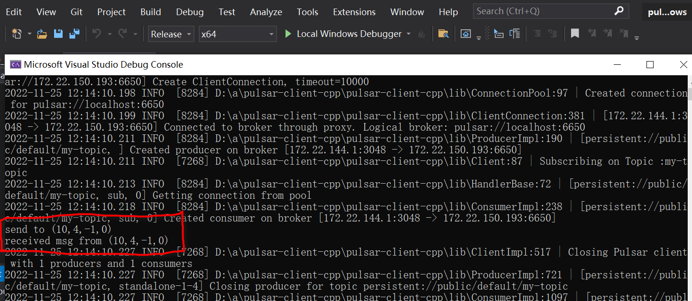

# pulsar-windows

Pulsar C++ client examples for MSVC project.

## Install Pulsar libraries for Windows

Download `x86-windows-static.tar.gz` and `x64-windows-static.tar.gz` from the release page like [3.1.0-candidate-1](https://dist.apache.org/repos/dist/dev/pulsar/pulsar-client-cpp/pulsar-client-cpp-3.1.0-candidate-1/) and uncompress them to `D:\x86-windows-static` and `D:\x64-windows-static`. You can also uncompress them to other directories, but the project configurations should be modified as well.

## Before running

Make sure there is a Pulsar service listened on `localhost:6650`, the simplest way is to [start a Pulsar standalone in docker](https://pulsar.apache.org/docs/2.10.x/getting-started-docker).

For a existing Pulsar service, you need to modify the `service_url` variable in the C++ source files.

## Testing

Use Visual Studio 2019 (or later) to open the solution. You will see two projects in this solution.
- pulsar-windows: link dynamically to `pulsar.dll` and `pulsar.lib`
- pulsar-windows-static: link statically to `pulsarWithDeps.lib`

Each project only supports Release configuration and both Win32 and x64 platforms.

Take `pulsar-windows-static` for example. Select `pulsar-windows-static` in **Solution Explorer**, right click **Set as Startup Project**.

Since the official releases only include Release version libraries, these projects only have the Release configuration configured. You should choose the **Release** in the toolbar, and select x86 or x64 to test.

Then, click `Build > Build Solution` in the menu to build the project, and click `Debug > Start Without Debugging` in the menu to run the example.

